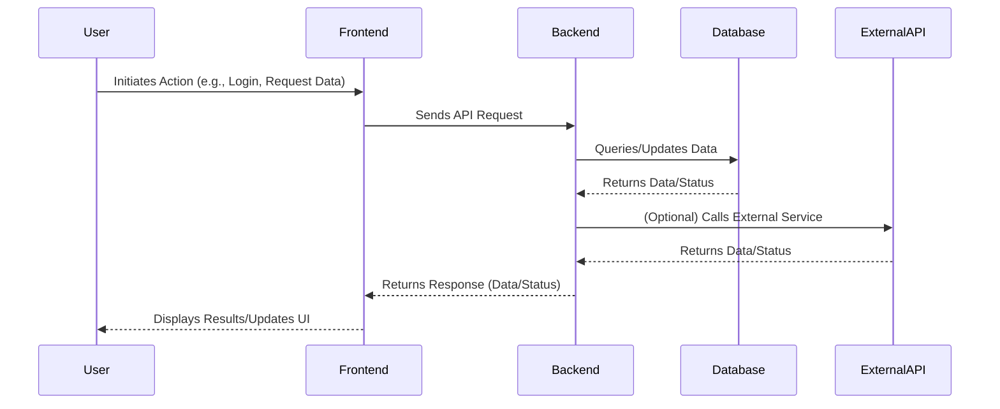

```mermaid
sequenceDiagram
    participant User
    participant Frontend
    participant Backend
    participant Database
    participant ExternalAPI

    User->>Frontend: Initiates Action (e.g., Login, Request Data)
    Frontend->>Backend: Sends API Request
    Backend->>Database: Queries/Updates Data
    Database-->>Backend: Returns Data/Status
    Backend->>ExternalAPI: (Optional) Calls External Service
    ExternalAPI-->>Backend: Returns Data/Status
    Backend-->>Frontend: Returns Response (Data/Status)
    Frontend-->>User: Displays Results/Updates UI
```
