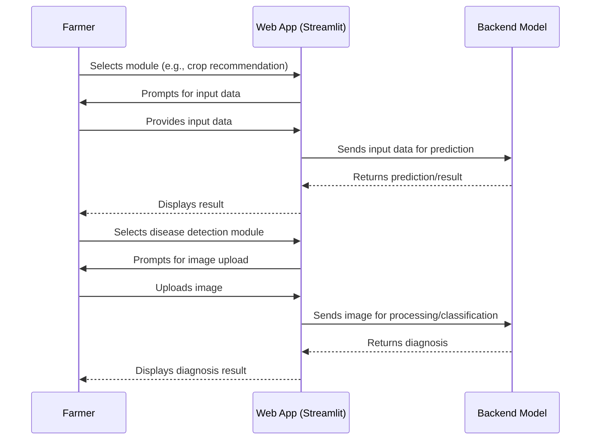

```mermaid
sequenceDiagram
    participant Farmer
    participant WebApp as Web App (Streamlit)
    participant Backend as Backend Model

    %% General module flow (e.g., crop recommendation)
    Farmer->>WebApp: Selects module (e.g., crop recommendation)
    WebApp->>Farmer: Prompts for input data
    Farmer->>WebApp: Provides input data
    WebApp->>Backend: Sends input data for prediction
    Backend-->>WebApp: Returns prediction/result
    WebApp-->>Farmer: Displays result

    %% Disease detection module flow
    Farmer->>WebApp: Selects disease detection module
    WebApp->>Farmer: Prompts for image upload
    Farmer->>WebApp: Uploads image
    WebApp->>Backend: Sends image for processing/classification
    Backend-->>WebApp: Returns diagnosis
    WebApp-->>Farmer: Displays diagnosis result
```
